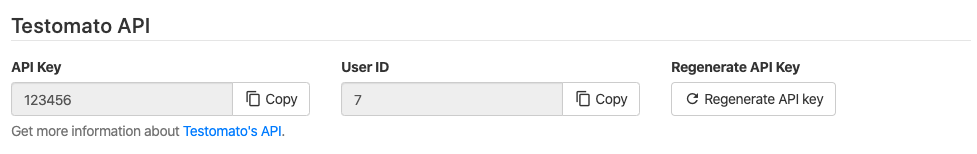

All API endpoints require authentication via an **API key**. Each
project has its own unique API key that protects your data against
unwanted access. An API key parameter is **mandatory** for all requests.

You can find your API Key at the bottom of **Project Settings**

You can also use user key from your [User Profile](https://www.testomato.com/user/profile): 

